# Class Relationship Diagram

The following diagram reflects the current class-level structure in the repository.

```mermaid
classDiagram

class TypedDict
class ExplainabilityState
TypedDict <|-- ExplainabilityState

class ConfigLoader {
  +config_path
  +config
  +get(*keys, default)
  +as_dict()
}

class ModelLoader {
  +model_directory
  +save_model(model, model_name)
  +load_model(model_name)
  +model_exists(model_name)
  +list_models()
}

class ModelArtifactLoader {
  +model_path
  +registry
  +model
  +load()
  +extract_metadata()
}

class ProjectContextLoader {
  +context_path
  +text
  +register_reader(extension, reader)
  +load()
  +to_sections()
}

class DataDictionaryLoader {
  +dictionary_path
  +dataframe
  +load()
  +to_records()
}

class ArtifactValidator {
  +model_metadata
  +feature_records
  +context_sections
  +validate()
}

class ProjectKnowledge {
  +model_path
  +dictionary_path
  +context_path
  +model
  +build()
}

ProjectKnowledge --> ModelArtifactLoader : loads model metadata
ProjectKnowledge --> DataDictionaryLoader : loads feature records
ProjectKnowledge --> ProjectContextLoader : loads context sections
ProjectKnowledge --> ArtifactValidator : validates artifacts

class ModelAdapter {
  <<abstract>>
  +matches(estimator)$
  +extract(model, estimator, source_path)
}

class GenericModelAdapter
class SklearnTreeAdapter
class XGBoostAdapter
class AdapterRegistry {
  +register(adapter_cls)
  +resolve(estimator)
}

ModelAdapter <|-- GenericModelAdapter
ModelAdapter <|-- SklearnTreeAdapter
ModelAdapter <|-- XGBoostAdapter
ModelArtifactLoader --> AdapterRegistry : resolves adapter
AdapterRegistry ..> GenericModelAdapter : fallback
AdapterRegistry ..> SklearnTreeAdapter : specialized
AdapterRegistry ..> XGBoostAdapter : specialized

class DecisionTreeReader
class DecisionPathExtractor {
  +extract_path(sample)
}
class ForestPathExtractor {
  +extract_path(sample)
}
class FeatureImportanceExtractor {
  +get_feature_importance(sort_descending)
  +get_top_features(top_n)
}
class TreeStructureExporter
class TreeVisualizer

ForestPathExtractor --> DecisionPathExtractor : delegates per estimator

class XGBoostPathExtractor {
  +extract_path(sample)
}
class XGBoostFeatureImportanceExtractor {
  +get_feature_importance(sort_descending)
  +get_top_features(top_n)
}
class CounterfactualExplainer {
  +explain(sample, target)
}
class TreePredictionExplainer {
  +explain(decision_path_result)
}

XGBoostFeatureImportanceExtractor .. FeatureImportanceExtractor : same public API

class FeatureImportanceVisualizer
FeatureImportanceVisualizer --> FeatureImportanceExtractor : consumes output format
FeatureImportanceVisualizer --> XGBoostFeatureImportanceExtractor : consumes output format

class IntentClassifier {
  +classify(question)
}

class ExplanationProvider {
  <<abstract>>
  +generate(prompt)
}
class EchoExplanationProvider
class OpenAIExplanationProvider

ExplanationProvider <|-- EchoExplanationProvider
ExplanationProvider <|-- OpenAIExplanationProvider
```

## Notes

- This is a class-focused view; function-level orchestration in `agents/nodes.py` and `agents/router.py` is intentionally omitted.
- `DecisionPathExtractor` / `ForestPathExtractor` / `XGBoostPathExtractor` are selected via selector functions (duck-typed `extract_path` contract).
- `FeatureImportanceExtractor` and `XGBoostFeatureImportanceExtractor` share a duck-typed interface (`get_feature_importance`, `get_top_features`) without a common base class.
